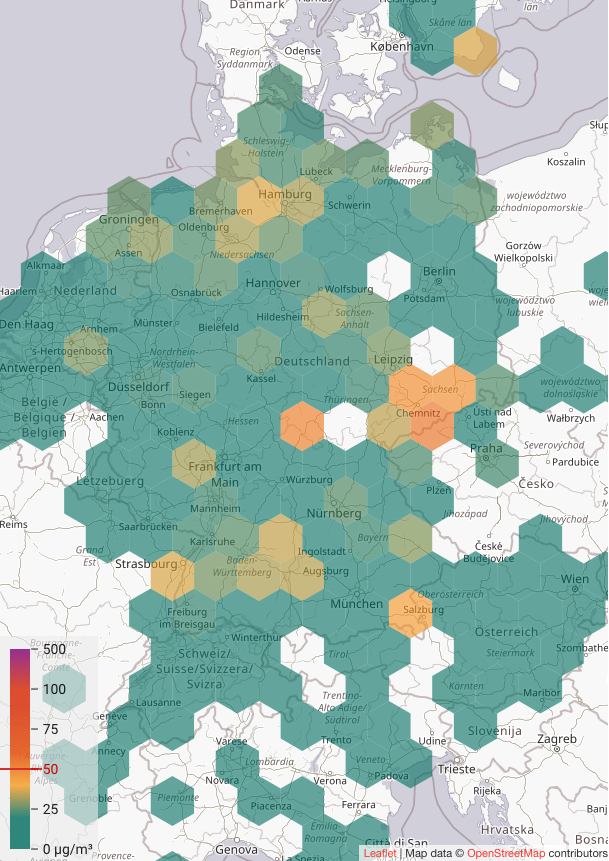
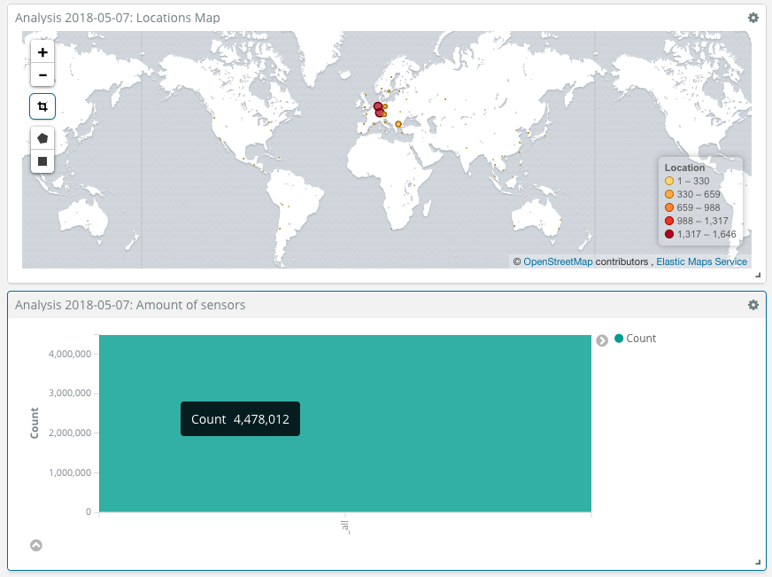
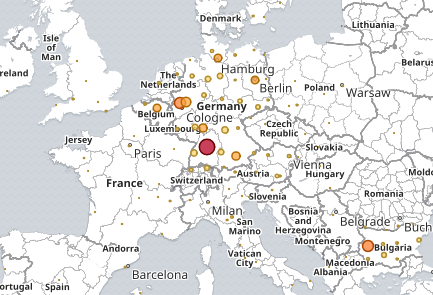
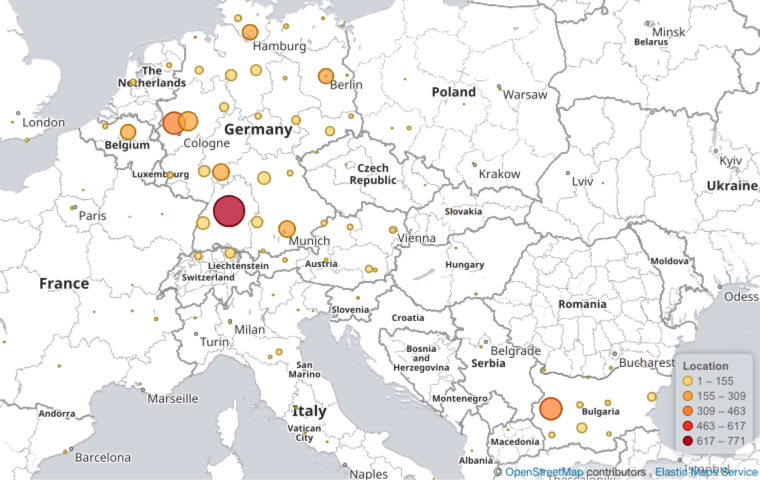
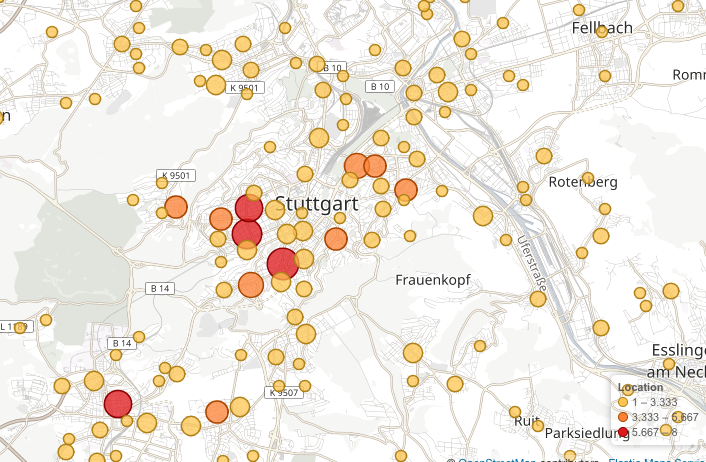
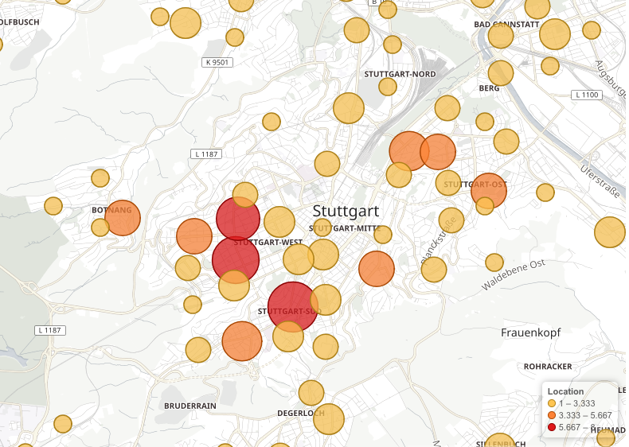
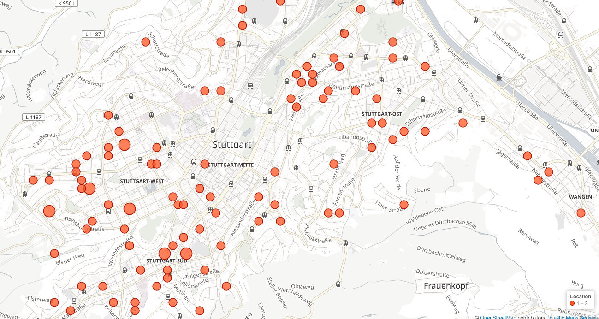
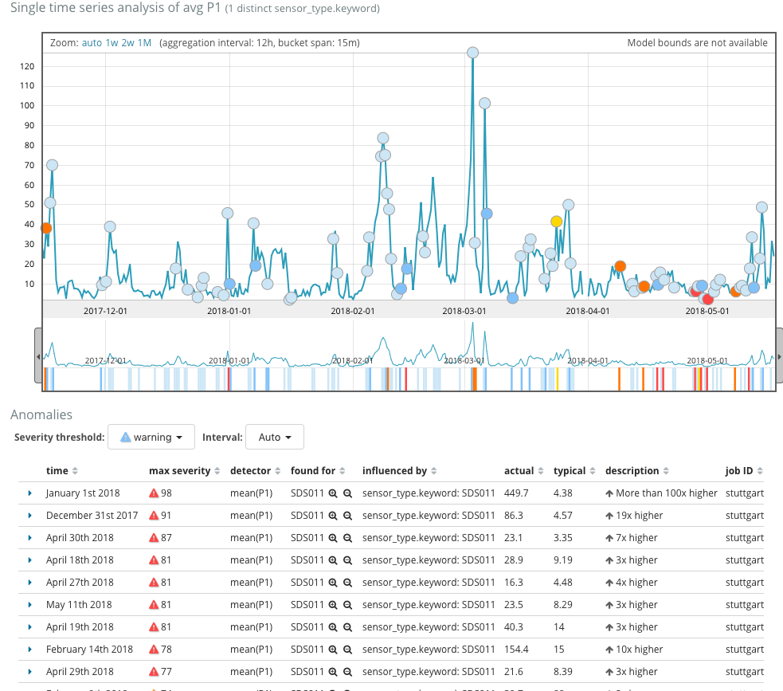

<div style="    text-align: center;
    font-size: 20pt;
    line-height: 34px;
    font-weight: bold;">

Big Data Analysis<br/> 
Potential value of the data of the citizen science project luftdaten.info around fine dust emissions and it's trend

</div>

<br/>
<br/>
<br/>
<br/>


<div style="text-align: right">Research by Martin Andreas Wörz, 20 Mai 2018</div>


## 1. Motivation

Editors note of the online magazine Spiegel presented alarming headlines:

Around the "Neckartor" in Stuttgart the EU safety limit for fine dust exceeded on 63 days about 42 per cent above the EU safety limit value of 35 micrograms per cubic meter with alarming 50 mg/m3. That's basically more than 2 months of the year (17,2%) that the values are way above the limit. (1)

The important problem with this exceeding value is, that the health of the population is affected, weather we want it or not. Fine dust attacks lungs, bronchi or mucous membranes. Moreover, it represents the potential of nitrous gases. (2)

Those nitrous gases are provoking headache, dizziness, shortness of breath and in the long run more damage to our health. Extreme values of those gases can even cause strokes.

Since Spiegel's meaning that politics seem not to act accordingly the motivation for this research could provide some insight of causes of high fine dust emissions. Hence, the results may provide potentials for new actions.


(1) [In diesen Städten ist die Luft am schlechtesten, Accessed at 13.5.2018](http://www.spiegel.de/wissenschaft/mensch/luftverschmutzung-2016-zahlreiche-staedte-ueberschreiten-grenzwert-a-1132445.html)

(2) [Feinstaub, NOX, CO2 - was ist eigentlich was?, Accessed at 13.5.2018](http://www.deutschlandfunk.de/luftverschmutzung-feinstaub-nox-co2-was-ist-eigentlich-was.1773.de.html?dram:article_id=391466)


## 2. Approach

The OK Lab Stuttgart is part of the Program Code for Germany and the Open Knowledge Foundation Germany. It's programmes goal is to support development in the field of Open Data Citizen Science. With its project luftdaten.info from they devote their work to measure and collect data around fine dust.

They also provide their data (measures of PM10 and PM2,5 values) on a virtual geo-map at http://deutschland.maps.luftdaten.info/.

 (1)

## 3. Goal

The initial goal of this analysis is to understand the collected and provided (big) data of the luftdaten.info project and evaluate potentials for further research usages. To define a scope the research will be limited to the area around Stuttgart.

## 4. Targets

In order to complete this analysis the following answers must be given:

1. Analyze the available data and check a potential usage. Moreover the unique locations, the data points, etc.
2. Check how many locations around Stuttgart and a radius of 20km from the center of Stuttgart are available.
3. Check what data is generally provided.
4. Check the quality of the data. Moreover, how many measurements and locations are constantly provided to exclude data inconsistency.
5. Check for anomalies in the values and find at least 3 events

The questions are ordered in priority. If some of those questions can not be answered, at least a reason why should be stated.

### 4.1 Initial Analysis

Volunteers around the globe have the option to buy and install a personal sensor and provide their data of fine dust  and weather conditions around the world. (1)

The data archive provides since the 1st of October in 2015. On the 9th Mai of 2018 the count is stating 5398177 measurements per day (3). From a small analysis on the existing files on that index, 9567 unique locations around the globe could be identified.

The next step is to investigate the data of one an exemplary date.

(1) [Luftdaten selber messen, Accessed at 9.5.2018](https://luftdaten.info/)

(2) [Data archive: Index of /](http://archive.luftdaten.info/)

(3) [Measurements 2018-05-09](http://archive.luftdaten.info/2018-05-09/measurements.txt)

## 4.1.1 Analysis of the data from 9th of Mai 2018

In order to get a better insight the listed files of the directory http://archive.luftdaten.info/2018-05-09/ is being analyzed using python.

When checking the multiple filenames, a naming pattern/structure can be recognized to store the measurements per location. Opening the file: '2018-05-09_bme280_sensor_113.csv' the following data structure can be found:


#### Data structure of file '2018-05-09_bme280_sensor_113.csv'
|sensor_id|sensor_type|location|lat|lon|timestamp|pressure|altitude|pressure_sealevel|temperature|humidity|
|---|---|---|---|---|---|---|---|---|---|---|
|113|	BME280|	3093|	48.809|	9.181|	2018-05-09T00:02:13|97215.77|	|	|	15.70|	57.08|
|113|	BME280|	3093|	48.809|	9.181|	2018-05-09T00:04:41|97217.53|	|	|	15.68|  57.29|


#### Recognized Naming Format
Since the sensor_id 113 and the sensor_type 'BME280' appears in the filename '2018-05-09_bme280_sensor_113.csv' we can identify the following naming structure of the filenames:

```
# 2018-05-09_bme280_sensor_113.csv 

# recognized naming format:
# YYYY-MM-DD_%sensor_type%_%data_type%_%sensor_id%

# YYYY-MM-DD -> is a date format of Year-Month-Day
```

This naming format could help to identify how many sensors are collecting data. The first glimpse of the data structure of the csv file combining the file naming format could help to map sensor_id to locations.

#### First assumption: 

Since the file with the id 113 and the used sensor 'BME280' does not contain any values about fine dust, the information must be included in other measurements. This assumption will be cross-referenced with the next steps.


### 4.1.1.1 Fetching the first data

1. **The first step is to provide a list of all data items on that day. Therefor the following script was created:**


```python
import glob
import os
from datetime import datetime
from time import time
import urllib.request
import pandas as pd
from bs4 import BeautifulSoup
from elasticsearch import Elasticsearch
from elasticsearch.helpers import bulk

# define the initial values
target_url = "http://archive.luftdaten.info/"
data_directory = 'data/luftdaten'

def fetch_links(resource_url, only_directories=False):
    """
        fetches all links on an HTML document
    :param resource_url: str url of the HTML document
    :return: list of urls
    """
    urls = []
    
    try:
        resp = urllib.request.urlopen(resource_url)
        
        soup = BeautifulSoup(resp, "html5lib", from_encoding=resp.info().get_param('charset'))
        
        for link in soup.find_all('a', href=True):
            if not only_directories or link['href'][-1] == '/':
                urls.append(link['href'])
    
    except Exception as e:
        print("Error occurred in fetching the data from: {}. Details:\n  {}".format(resource_url, e))
    
    return urls     
```


```python
def prepare_data_directory():
    """
        create the target directory
    """
    if not os.path.exists(data_directory):
        os.makedirs(data_directory)
```


```python
def download_resources(resource_url, last_days=0):
    """
        downloads all csv files
    :param resource_url: string
    :param last_days: int the amount of days back the files should be fetched

    """
    # create the data directories
    prepare_data_directory()

    # get all directories where are the .csv files stored (the directories are in the format: YYYY-MM-DD)
    date_directory_urls = fetch_links(target_url, True)

    # order by the newest to get the newest items first
    date_directory_urls.reverse()

    message = '{} directories of tracked days found'.format(len(date_directory_urls))
    print(message)
    
    if 0 < last_days < len(date_directory_urls):
        message = 'Only download files from the last {} days.'.format(last_days)
        print('  ' + message)
        date_directory_urls = date_directory_urls[:last_days]

    if date_directory_urls and len(date_directory_urls) > 0:
        
        for date_directory_url in date_directory_urls:
            
            # get the 2nd last value (2018-05-09)
            date_url_absolute = resource_url + date_directory_url

            # fetch the sub directory of the date 2018-05-09
            message = "Fetch the directory structure of the day {}".format(date_directory_url[:-1])
            print('  ' + message)
            
            file_urls = fetch_links(date_url_absolute)

            # generate a pandas DataFrame with all urls of that day
            df_file_urls = pd.DataFrame({'url': file_urls})

            message = "{} unique measurements found for the day".format(len(df_file_urls))
            print('  ' + message)
            # > resulting 9573 items

            # todo continue analysis here

```


```python
# fetch the url of the last directory
download_resources(target_url, last_days=1)
```

    948 directories of tracked days found
      Only download files from the last 1 days.
      Fetch the directory structure of the day 2018-05-16
      9758 unique measurements found for the day


2. **The next step is to resolve the format of the urls and fetch the id, date and sensor type from the urls.**

Here the following script was being used:


```python
def fetch_measurements(date_url_absolute):
    """
        method to fetch the urls of a date directory in the luftdaten archive
        it prints the amount of measurements per sensor type
    """
    date_str = date_url_absolute[-11:-1]
    
    # fetch the sub directory of the date 2018-05-09
    message = "Fetch the directory structure of the day {}".format(date_str)
    print('  ' + message)
    file_urls = fetch_links(date_url_absolute)

    if file_urls is None or len(file_urls) == 0:
        print("No data found for day: {}".format(date_str))
        return
        
    # write the data into a pandas DataFrame
    df_file_urls = pd.DataFrame({'url': file_urls})

    # extract the date, the sensor type, file type and location id
    df_file_urls = df_file_urls['url'].str.extract('(?P<url>(?P<date>[^_]+)_(?P<sensor>[^_]+)_(?P<type>[^_]+)_(?P<id>[^_.]+).*)', expand=True)

    # parse the date
    df_file_urls['date'] = pd.to_datetime(df_file_urls['date'], format="%Y-%m-%d", errors="ignore")

    sensor_counts = df_file_urls[['id', 'sensor']].groupby(['sensor']).size().sort_values(ascending=False).to_dict()   

    # print the sensor type and the measurements
    print("Sensor Type: Mesurements")
    print("\n".join(["{} {}".format(key.rjust(12), str(item).rjust(11)) for key, item in sensor_counts.items()]))
```


```python
fetch_measurements('http://archive.luftdaten.info/2018-05-09/')
```

      Fetch the directory structure of the day 2018-05-09
    Sensor Type: Mesurements
          sds011        4990
           dht22        3603
          bme280         889
          bmp180          57
             hpm           7
         ppd42ns           6
         pms3003           6
         pms7003           5
         pms5003           2
          bmp280           2


After investigating the column: 'sensor' it clearly states that there are multiple kinds of sensor being used. Now let's get the count of which sensor type is being used the most:

    
#### First result
This shows that the sensor types: **sds011** and **dht22** are being used most of the times.


To check the availability of the data let's perform the same steps on the data provided one year before:

## 4.1.2 Analysis of the data from 9th of Mai 2015, 9th of Mai 2016 and 9th of Mai 2017

The same steps as in 4.1.1 have been performed and the result was for the following dates:


```python
investigating#### Results for 09-05-2017

fetch_measurements('http://archive.luftdaten.info/2017-05-09/')
```

      Fetch the directory structure of the day 2017-05-09
    Sensor Type: Mesurements
          sds011         865
           dht22         734
          bme280          47
         ppd42ns          11
          bmp180           6


```python
#### Results for 09-05-2016

fetch_measurements('http://archive.luftdaten.info/2016-05-09/')
```

      Fetch the directory structure of the day 2016-05-09
    Sensor Type: Mesurements
         ppd42ns          12
           dht22           4


```python
#### Results for 09-05-2015

fetch_measurements('http://archive.luftdaten.info/2015-05-09/')
```

      Fetch the directory structure of the day 2015-05-09
    Error occurred in fetching the data from: http://archive.luftdaten.info/2015-05-09/. Details:
      HTTP Error 404: Not Found
    No data found for day: 2015-05-09


---

### INTERMEDIATE DATA ANALYSIS RESULTS

- **After this insight, we can see that the data in on 09-05-2016 is very limited.**
- **On the other hand in 2017 the sensors by the types sds011 and dht22 where exceeding over 700 measurements per day.**

---

## 4.1.3 Further Analysis of the data from 9th of Mai 2018

The next step to gain insights of the differences of the certain available sensor types, the following information could be extracted by opening for each sensor type the .csv files.

For the 2018-05-16 the following unique locations with the following sensor values could be identified:

| Sensor Type   | Locations | Available values                          |
| ----          | ---       | ---                                       |
| sds011        |      5094 | P1, P2                                    |
| dht22         |      3672 | temperature, humidity                     |
| bme280        |       913 | temperature, pressure                     |
| bmp180        |        58 | temperature, pressure                     |
| pms3003       |         7 | P1, P2                                    |
| hpm           |         7 | P1, P2 |                                  |
| ppd42ns       |         6 | P1, P2, durP1, ratioP1, durP2, ratioP2    |
| pms7003       |         5 | P1, P2                                    |
| pms5003       |         3 | P1, P2                                    |
| bmp280        |         2 | temperature, pressure                     |


---

### INTERMEDIATE DATA ANALYSIS RESULTS

This provides the information, that we have the following values provided in general:

- **P1, P2, temperature, pressure**


To know what the values P1 and P2 represent the research has to be continued:

---

## 4.2 Definition fine dust

Dusts are solid particles of the outside air, which do not sink immediately to the ground but stay in the atmosphere for a certain time. Depending on their size, dust particles are divided into different classes. 

### PM10 (P1)

Particulate matter (PM10) refers to particles with an aerodynamic diameter of less than 10 μm. 

### PM2,5 (P2)
Of these particles, one part has an aerodynamic diameter smaller than 2.5 μm (PM2.5). This includes the fraction of ultrafine particles (<0.1μm).

[Source: Emission von Feinstaub der Partikelgröße PM2,5, Accessed at 13.5.2018](https://www.umweltbundesamt.de/daten/luft/luftschadstoff-emissionen-in-deutschland/emission-von-feinstaub-der-partikelgroesse-pm25#textpart-3)


## 5. Data Research with ElasticSearch

To make more sense out of the data, a python script was created to import the csv data into ElasticSearch. Together with Kibana, the data can be intensively and intuitively be analyzed.

This script can be found here:

<a href="luftdaten_index.py">See script luftdaten_search_geo_data.py</a>


### Strategy to answer research questions

To answer the 1. and the 2. question of the potential usage of the data the following approach might help to get more insights:

- **A.1. Analyze the data of one specific day. As previously noticed, in one day there are nearly 10k measurements. The analysis of one day can give a representative overview of the different available locations. **
- **A.2 In which countries, regions cities are concentrations of multiple sources.**
- **A.3 In case of reducing single points of failures, it's necessary to analyze the data of a certain region where not only a few sensors are active.**
- **A.4 Analyse the available data and check a potential usage. Moreover the unique locations, the data points, etc. Check how many locations around Stuttgart and a radius of 20km from the center of Stuttgart are available.**
- **A.5 Analyse the data over a period of time period on selected regions. (Preferably with areas with multiple sensors in a near area)**

### 5.1. Analysis of the day 2018-05-07

After indexing all data of all available csv files of the data 2018-05-07 the research can be started.

To answer the question 1.1. A Dashboard with a Geo Map visualization was created. The first results of available locations around the world in one day shows this:

### Result: Unique Geo Locations around the world 



The visualization provides the information that there are 4,4 mio data points collected in a single day and there are unique locations all around the world. But the most sensors are found in Europe.

The analysis will be continued in Europe:

### Result: Unique Geo Locations around europe 



This results shows that there are areas in the following countries, to which might be interesting to be investigated more in detail:

|Importance|Interesting regions|
|---       | ---               |
|1.        | Germany           |
|2.        | Belgium           |
|3.        | Bulgaria          |

### Result: Geo areas/cells in Europe with more than 180 unique locations

A zoom + the move over functionality of ElasticSearch helps to figure out the following information about the 6 locations:
    


|Prio|Area|Locations approx.|
|---|---|---|
|1.|Germany, Baden-Wuerttemberg|771|
|2.|Germany, Western part of North Rhine-Westphalia|396|
|3.|Bulgaria, Sofia|389|
|4.|Germany, Eastern part of North Rhine-Westphalia|298|
|5.|Germany, Bavaria, Munich|219|
|6.|Germany, Hamburg|189|
|7.|Germany, Berlin|185|
|8.|Belgium|183|

### Conclusion of results

The most top 3 most valuable areas within Germany, where a research can performed further are:
    
|Prio|Area|Locations approx.|
|---|---|---|
|1.|Germany, Baden-Wuerttemberg|771|
|2.|Germany, Western part of North Rhine-Westphalia|396|
|3.|Germany, Eastern Nordrhein Westfalen, Köln area|298|

### Result: Geo areas around Baden-Wuerttemberg

But for the scope of this research the analysis the scope will be limited to the area of Stuttgart. In order to do that, the first area is researched more in detail.


### Result: Geo areas around Stuttgart


### Result: Geo areas around Stuttgart Zoom Level 1


### Result: Geo areas around Stuttgart Zoom Level 2


By the last step we can identify that there are the following collective areas, which could be used to investigate:

|Importance|Interesting areas/cells|
|---       | ---                   |
|1.        | Stuttgart south/center, area along the city center  |
|2.        | Stuttgart west, area around the street Bebelstraße  |
|3.        | Stuttgart easth, area around the street Neckartor   |

The most important part now it to create a geometric boundary to limit the areas. In that case the following areas have been created:

### Result: 1. Geo Shape of area: Stuttgart south/center, area along the city center
```
{
  "geo_polygon": {
    "ignore_unmapped": true,
    "geo_location": {
      "points": [
        {
          "lat": 48.7645060889677,
          "lon": 9.160966873168947
        },
        {
          "lat": 48.769258228422665,
          "lon": 9.174184799194338
        },
        {
          "lat": 48.76546786777273,
          "lon": 9.180965423583986
        },
        {
          "lat": 48.75749020404446,
          "lon": 9.168004989624025
        }
      ]
    }
  }
}
```

### Result: 2. Geo Shape of area: Stuttgart west, area around the street Bebelstraße
```
{
  "geo_polygon": {
    "ignore_unmapped": true,
    "geo_location": {
      "points": [
        {
          "lat": 48.77106844897414,
          "lon": 9.151782989501955
        },
        {
          "lat": 48.77265233842162,
          "lon": 9.15538787841797
        },
        {
          "lat": 48.78068415138507,
          "lon": 9.164314270019533
        },
        {
          "lat": 48.783568502957735,
          "lon": 9.155559539794924
        },
        {
          "lat": 48.77615934438715,
          "lon": 9.148778915405275
        }
      ]
    }
  }
}
```

### Result: 3. Geo Shape of area: Stuttgart east, area around the street Neckartor
```
{
  "geo_polygon": {
    "ignore_unmapped": true,
    "geo_location": {
      "points": [
        {
          "lat": 48.785774071728454,
          "lon": 9.187574386596681
        },
        {
          "lat": 48.78990218352415,
          "lon": 9.194955825805666
        },
        {
          "lat": 48.7899587306429,
          "lon": 9.201908111572267
        },
        {
          "lat": 48.78718784688117,
          "lon": 9.201478958129885
        },
        {
          "lat": 48.782776736678855,
          "lon": 9.19735908508301
        },
        {
          "lat": 48.78192840180478,
          "lon": 9.190578460693361
        }
      ]
    }
  }
}
```

### Analysis: Get the unique locations of each of the areas

The next task would be to idenfity the unique locations/sensor ids of those areas to fetch the related files from the luftinfo archive. To get this list the the script 'luftdaten_search_geo_data.py' has been created.

<a href="luftdaten_search_geo_data.py">See script luftdaten_search_geo_data.py</a>

Sensor ids for the area of Stuttgart south for the sensors with fine dust values:<br>
[219, 430, 549, 671, 673, 723, 751, 757, 1364, 2199, 2820, 8289] (12 locations) 

Sensor ids for the area of Stuttgart south for the sensors with weather values:<br>
[431, 550, 672, 674, 724, 752, 758, 1365, 2200, 2821, 8290, 11462, 12323] (13 locations) 

Sensor ids for the area of Stuttgart west for the sensors with fine dust values:<br>
[140, 187, 553, 576, 727, 1324, 4640, 5750, 6509, 6549, 6763, 7078, 8275, 9900, 10546] (15 locations) 

Sensor ids for the area of Stuttgart west for the sensors with weather values:<br>
[141, 188, 728, 1325, 4641, 5751, 6510, 6550, 6764, 7079, 8276, 9901, 10547] (13 locations) 

Sensor ids for the area of Stuttgart east for the sensors with fine dust values:<br>
[143, 217, 227, 415, 1657, 1739, 1931, 6479, 9840, 10963] (10 locations) 

Sensor ids for the area of Stuttgart east for the sensors with weather values:<br>
[155, 218, 228, 416, 1658, 1740, 1932, 9841, 10964, 11286, 11934] (11 locations) 


### Analysis: Perform P10 and P2,5 anomaly analysis 

By this information, it's possible to fetch the specific data from those geologic areas.

For this case the python script: <a href="luftdaten_index.py">luftdaten_index.py</a> has been extended to only fetch the data for the sensor ids as researched in the section above.

After indexing those sensor ids an anormaly detected with the integrated Machine Learning module in Elasticsearch the following anormalies could be detected:




|time|max severity|detector|found for|influenced by|actual|typical|description|job ID|
|---|---|---|---|---|---|---|---|---|
|January 1st 2018|98|	mean(P1)|	SDS011|  	sensor_type.keyword: SDS011|449.7|	4.38|	 More than 100x higher|	stuttgart-p1-p2-anormalies|
|December 31st 2017|	 91|	mean(P1)|	SDS011|  	sensor_type.keyword: SDS011|86.3|	4.57|	 19x higher|	stuttgart-p1-p2-anormalies
|April 30th 2018|	 87|	mean(P1)|	SDS011|  	sensor_type.keyword: SDS011|23.1|	3.35|	 7x higher|	stuttgart-p1-p2-anormalies
|April 18th 2018|	 81|	mean(P1)|	SDS011|  	sensor_type.keyword: SDS011|28.9|	9.19|	 3x higher|	stuttgart-p1-p2-anormalies
|April 27th 2018|	 81|	mean(P1)|	SDS011 | 	sensor_type.keyword: SDS011|16.3|	4.48|	 4x higher|	stuttgart-p1-p2-anormalies|
|May 11th 2018|	 81|	mean(P1)|	SDS011|  	sensor_type.keyword: SDS011|23.5|	8.29|	 3x higher|	stuttgart-p1-p2-anormalies|
|April 19th 2018|	 81|	mean(P1)|	SDS011|  	sensor_type.keyword: SDS011|40.3|	14|	 3x higher|	stuttgart-p1-p2-anormalies|
|February 14th 2018|	 78|	mean(P1)|	SDS011|  	sensor_type.keyword: SDS011|154.4|	15|	 10x higher|	stuttgart-p1-p2-anormalies|
|April 29th 2018|	 77|	mean(P1)|	SDS011 | 	sensor_type.keyword: SDS011|21.6|	8.39|	 3x higher|	stuttgart-p1-p2-anormalies|

## Conclusion

The data of luftdaten.info are most valuable in the following greater areas:

|Prio|Area|Locations approx.|
|---|---|---|
|1.|Germany, Baden-Wuerttemberg|771|
|2.|Germany, Western part of North Rhine-Westphalia|396|
|3.|Bulgaria, Sofia|389|
|4.|Germany, Eastern part of North Rhine-Westphalia|298|
|5.|Germany, Bavaria, Munich|219|
|6.|Germany, Hamburg|189|
|7.|Germany, Berlin|185|
|8.|Belgium|183|

Moreover if a reaserch in those greater areas are performed, locations of a higher density of sensors need to be found and be researched.

With this research the area of Stuttgart has been investigated. There geo shapes have been created with at least each 10 sensors with the values (reference to 4.1.3) are providing weather date and 10 other sensors providing fine dust values.

Also this information was value enough to find anormaly pattern for the **P10** and **P2,5** values.
